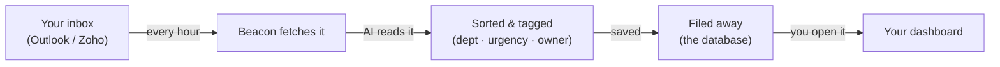

# How Beacon works, end to end

A plain-English walkthrough of what this dashboard actually does — no assumed
knowledge of "frontend," "backend," or any of that. For the technical
reference (file layout, gotchas, exact tables), see [AGENTS.md](AGENTS.md).
This doc is the "what am I actually looking at" version.

Beacon watches a mailbox so nobody has to read every email by hand. It pulls
mail in, has an AI sort and tag each message, and lays the results out on a
screen that can be scanned in a minute.

## The journey of one email

From the moment a message lands in the connected inbox to the moment it shows
up as a tile on the dashboard, it passes through five stops:



### 1. Someone connects a mailbox

A staff member (or you) logs into Beacon and grants it permission to read a
specific mailbox — Microsoft 365 or Zoho. That permission is stored,
encrypted, so Beacon can come back and check later without anyone re-typing a
password. Some inboxes are **shared team inboxes** rather than one person's
own — Beacon can be granted access to those too, on someone else's behalf.

*Behind the scenes: Microsoft/Zoho OAuth login, encrypted access token.*

### 2. Beacon fetches new mail, on a schedule

A timer built into Beacon wakes up once an hour and asks each connected inbox
"anything new since last time?" It isn't watching in real time — it's
checking in, like a mail carrier on a route. A freshly connected inbox gets a
bigger first sweep (the last 30 days, or further back for some clients) so
there's something on the dashboard right away.

*Behind the scenes: hourly scheduled job, Microsoft Graph API, Zoho Mail API.*

### 3. An AI reads and tags every message

This is the part doing the actual thinking. Each new email is handed to a
language model with one job: decide which **department** it belongs to, how
**urgent** it is, and whether it looks like an **escalation** (something
going wrong that needs attention). Beacon also works out *who* should be
treated as the responsible person — matching the sender, or, for a shared
inbox, reading the staff member's name out of the email's own signature.

*Behind the scenes: AI classifier, department/urgency/escalation tags,
responsible-person matching.*

### 4. The result gets filed away

The email plus everything the AI decided about it gets written into Beacon's
database — a structured filing system that can be searched and totaled up
instantly, instead of a pile of messages someone has to reread. If more than
one company uses this same Beacon deployment, each company's mail,
departments, and people are kept in entirely separate compartments.

*Behind the scenes: Postgres database, kept separate per client.*

### 5. You open the dashboard and see it laid out

When you load Beacon in your browser, it asks the filing system for whatever
you're currently looking at — today's escalations, a department's totals, a
person's response times — and draws it as cards, lists, and charts. Nothing
is computed in advance and sitting there stale; every screen is assembled
fresh, right when you open it.

## What happens the moment you open the dashboard

Stage 5 above, slowed down. This loop runs every time you load a page or
switch tabs — it takes a fraction of a second.

```mermaid
sequenceDiagram
    participant You as You (browser)
    participant Engine as Beacon's engine
    participant DB as The database
    You->>Engine: "show me today"
    Engine->>Engine: checks what you're allowed to see
    Engine->>DB: looks up the rows
    DB-->>Engine: matching rows
    Engine-->>You: renders as cards &amp; charts
```

Your click sends a request, Beacon's engine first works out **which
mailboxes you personally are allowed to see** (a CEO or admin sees everything
pooled together; everyone else sees only their own), then asks the database,
and turns what comes back into the screen in front of you.

## Replying — and why some inboxes say no

You can reply to an email straight from Beacon in most cases. There's one
deliberate exception, worth knowing about so it doesn't look like a bug:

| | You click Reply | What happens |
|---|---|---|
| **A mailbox you personally own** | Beacon has send access | Reply is sent |
| **A shared / delegated team inbox** | Blocked, on purpose | Read-only, by client agreement |

For a mailbox someone connected themselves, Beacon can both read and send.
For a shared team inbox that was only *delegated* to Beacon so a manager
could see its traffic, Beacon was deliberately given read-only access —
matching what the client agreed to. It's not a missing feature; it's a
boundary that's meant to hold.

## The handful of words worth knowing

| Term | What it means here |
|---|---|
| **frontend** | The part you actually look at — the dashboard, its charts and tabs, running in your browser. |
| **backend** | Beacon's engine, running on a server. Fetches mail, talks to the AI, answers the frontend's questions. |
| **database** | The filing system — every classified email, person, and department, stored so it can be searched and totaled instantly. |
| **LLM / classifier** | The AI model that reads each email and decides its department, urgency, and escalation status. "LLM" just means "the kind of AI that reads and writes language." |
| **OAuth login** | The "sign in with Microsoft / Zoho" step — how a mailbox owner grants Beacon permission without handing over a password. |
| **cron job** | A task on a timer. Beacon's hourly mail check is a cron job. |
| **API** | A fixed set of questions one piece of software is allowed to ask another — the frontend asks the backend for data; the backend asks Microsoft/Zoho for mail. |

## Moving to a new machine

This repo was developed on one machine against a **real, live production database**
(Supabase-hosted Postgres) serving real client data. Moving to a new system:

1. **Clone/copy the repo as normal** — everything version-controlled comes with it.
2. **`backend/.env` is gitignored and will NOT come with the repo.** You must copy
   that file directly (not retype it from memory) from the old machine to the new
   one — via a password manager secure note, encrypted transfer, whatever your own
   security practice is. See `backend/.env.example` for what each key is *for*, but
   copy the **actual working file**, not a freshly-filled-in template.
3. **Do NOT regenerate `TOKEN_ENCRYPTION_KEY`.** It must be the exact same value as
   what's already in use — it's what decrypts every already-stored OAuth token in
   the real database (`oauth_tokens.access_token`/`refresh_token`, encrypted via
   `pgcrypto`). Change this value and every existing mailbox connection becomes
   permanently undecryptable — everyone would need to reconnect from scratch.
4. Everything else (`DATABASE_URL`, `AZURE_*`, `ZOHO_*`, `SESSION_SECRET`,
   `CLASSIFIER_PROVIDER` + its key) should also just be copied as-is unless you
   specifically intend to point at a different database/app registration/LLM
   provider going forward.
5. Classification is Gemini-only (`CLASSIFIER_PROVIDER=gemini`) — DeepSeek, Groq,
   and Ollama support were removed. A `GEMINI_API_KEY` and `LLM_MONTHLY_CAP_USD`
   (hard spend cap, see `AGENTS.md`) should already be set; no local model install
   is needed on a new machine.

See [AGENTS.md](AGENTS.md)'s "Dev commands" section for the actual
install/migrate/start steps — this section is only about the production
secrets and database, which those commands don't cover.

---

Every stop above corresponds to a real, working part of this codebase — the
ingestion timer, the AI classifier, the database, the dashboard routes — not
a simplified stand-in. The technical map underneath this picture (exact file
names, gotchas, migration history) lives in [AGENTS.md](AGENTS.md).
